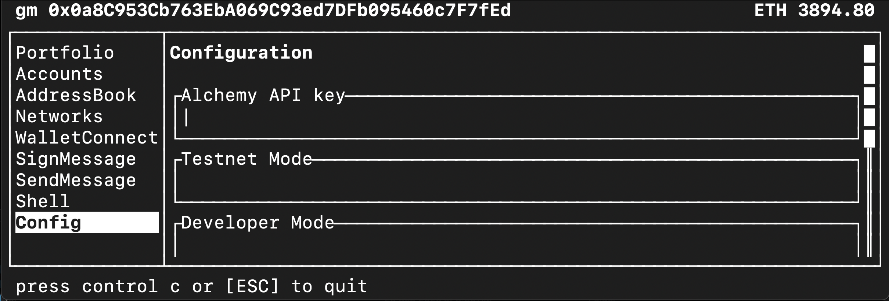

Terminal-based Ethereum accounts manager



## Features

- Apple keychain: securely store your keys
- Address book: keep familiar accounts handy
- Light client: don't trust rpc data blindly
- Walletconnect: connect to dapps
- EIP-1193 provider + shell exec: avoid .env secrets in your scripts

## Live Demo

```
ssh demo@gm-tui.com
```

Run the above command in your terminal, it connects to a EC2 instance which has gm wallet already installed so you can preview it without installing anything.

## Installation

### From source

Installation from source is highly recommended if you do not trust the pre-built binaries in the releases. However, building locally takes several minutes depending on your system, but once its done you're good to go.

```sh
# 1. Clone the repository:
git clone https://github.com/zemse/gm.git
cd gm/bin
cargo install --path .
```

## Usage

Start the application by opening the terminal and entering:

```
$ gm
```

## License

This project is licensed under the MIT License - see the [LICENSE](LICENSE) file for details.
